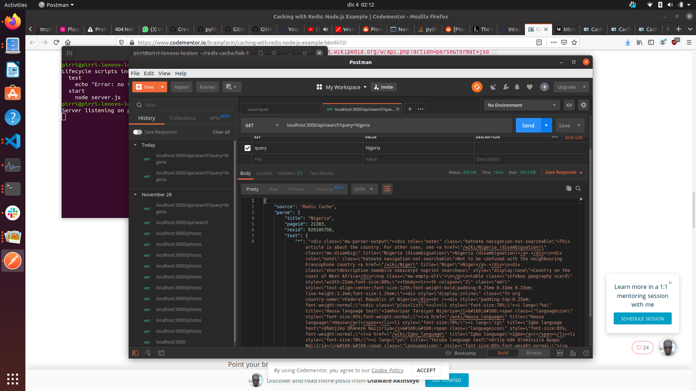
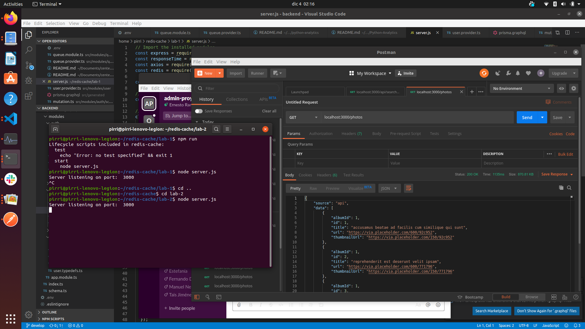
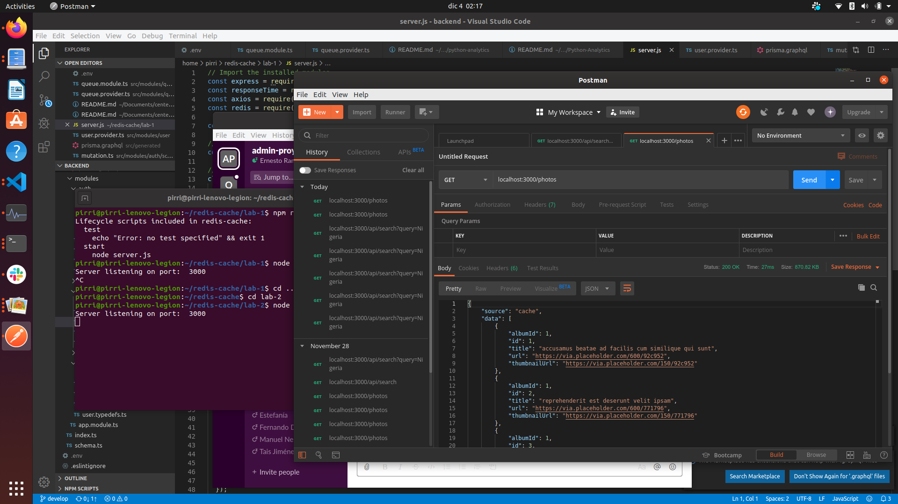

# redis-labs
Lab-1 refers to the tutorial at https://www.codementor.io/brainyfarm/caching-with-redis-node-js-example-h6o9ii72i

Lab-2 refers to the tutorail at https://medium.com/tech-tajawal/introduction-to-caching-redis-node-js-e477eb969eab

## Lab-1

Note the difference in response time, from various seconds to a few miilliseconds

## Lab-2

Note the difference in response time, from thousands of miliseconds to a few miilliseconds
